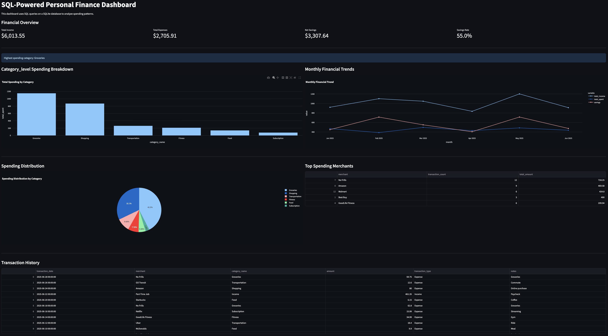
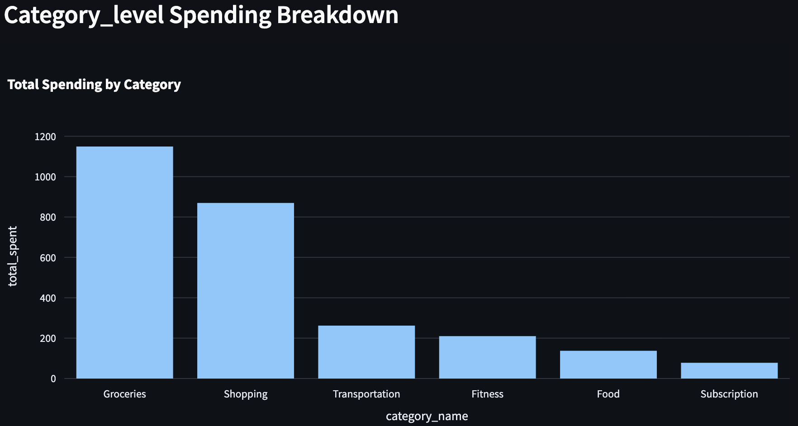
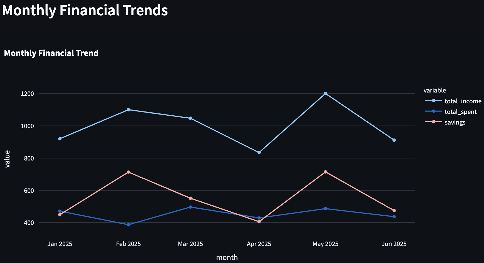
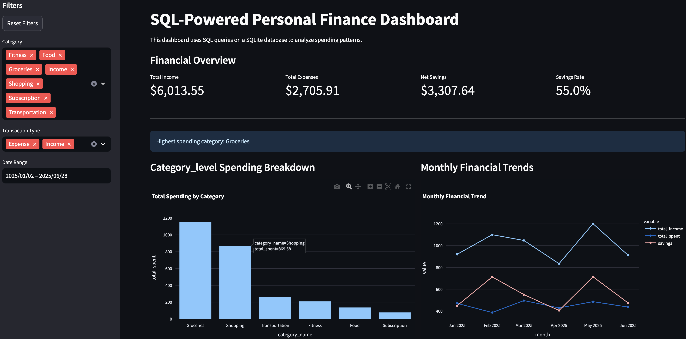

# SQL-Powered Personal Finance Dashboard

An end-to-end data analytics project that transforms raw transaction data into actionable financial insights using SQL, Python, and interactive visualization.

This project demonstrates the full pipeline: data ingestion -> database design -> SQL querying -> analytics -> dashboard visualization.

---

## Key Features

- Built a **relational SQLite databse** from transaction-level data
- Wrote optimized **SQL queries** to compute financial metrics
- Developed an **interactive Streamlit dashboard**
- Implemented dynamic **filters** (category, transaction type, date range)
- Computed key financial KPIs:
    - Total Income
    - Total Expenses
    - Net Savings
    - Savings Rate
- Visualized:
    - Category-level spending breakdown
    - Montly income vs expenses vs savings trends
    - Spending distribution
    - Top merchants by spend
- Designed for **real-time exploration of financial behavior**

---

## Screenshots

### Dashboard Overview


### Monthly Spending by Category


### Monthly Financial Trends


### Interactive Filters


---

## Technical Highlights

- **SQL-first design**: Core computations (aggregations, grouping, filtering) handled in SQL
- **Seperation of concerns**:
    - `create_database.py` -> data ingestion
    - `queries.py` -> SQL logic
    - `app.py` -> visualization layer
- **Data pipeline mindset**:
    - CSV -> SQLite -> pandas -> dashboard
- Efficient use of:
    - `GROUP BY`, `SUM`, filtering
    - Joins / merges for monthly aggregation
- Built reusable query functions for modular analytics

---

## Tech Stack

- **Python**
- **SQLite / SQL**
- **pandas**
- **Streamlit**
- **Plotly**

---

## Project Structure

```text
sql-finance-dashboard/
├── app.py                      # Streamlit dashboard
├── create_database.py          # Builds SQLite database
├── queries.py                  # SQL query functions
├── README.md
├── requirements.txt
├── README.md
├── data/
│   ├── sample_transactions.csv
│   └── finance.db
└── screenshots/